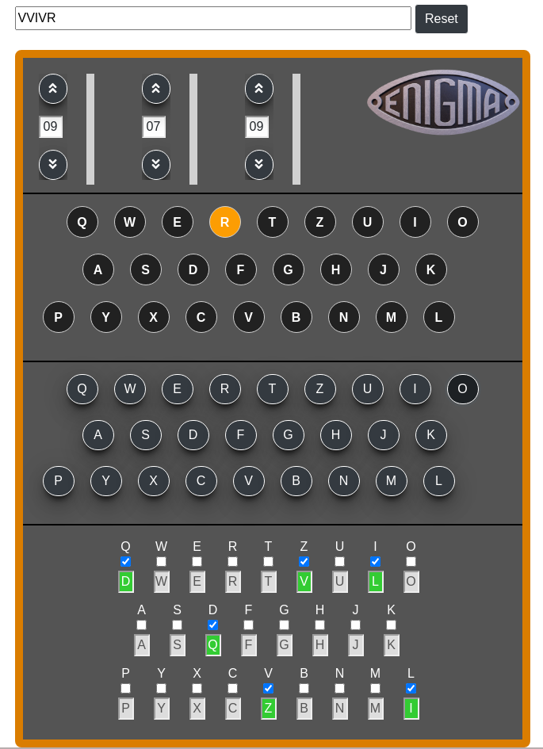

# Enigma JS

# What is Enigma JS
Enigma JS is a Javascript application that reproduces the Enigma machine functioning.
The entire premise and mechanism has been recreated in Javascript code. 
The rotors and plugboard are both managed by algorithms that mimic their original functioning.

# Important things to know before creating encrypted messages.
There are no numbers on the Enigma keyboard. If you want to use a number, you will have to spell it out in letters.  

There are also no punctuations marks on the Enigma keyboard. Use the following letters for punctuation:  
period = X  
comma = ZZ  
question mark = FRAGE or FRAQ  
